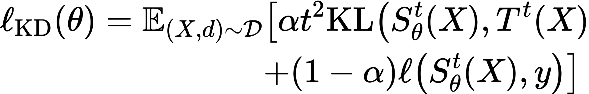
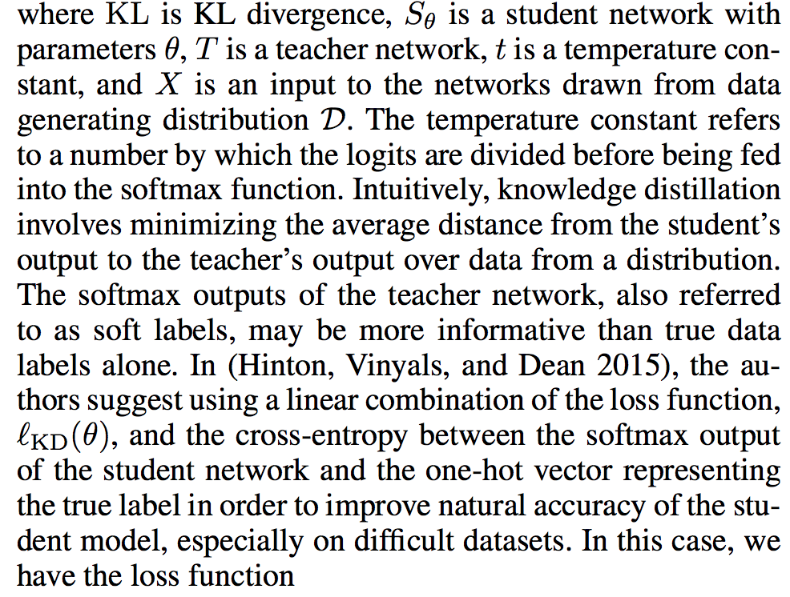

# Model stole by knowledge Distillation or Perturbance driven Generation 

## Install and preparation 
```
## recommend starting from py37
#conda create -n py37 python=3.7 


pip install -r req.txt
```


### 1. KD
*  A framework for exploring "shallow" and "deep" knowledge distillation (KD) experiments


* formula 

[]()
[]()
[https://arxiv.org/pdf/1905.09747.pdf](reference)
* Finetune

 Edit the hyperparameter
 
```

cat experiments/base_model/params.yaml  
#start the train epoches 
cd model_stealing
sh run.sh 

```
* Result (finished at 100% train data)


| Victim              |  train_acc(Victim)        |  test_acc(Victim)      | Thief      |  train_acc(Thief)        |  test_acc(Thief)        | 
| :------------------:    | :----------------: | :-----------------:|:-----------------:|:-----------------:|:-----------------:|
| resnet18             | 98.2%             |  93.7%            |  [resnet18](model_stealing/models/resnet.py)   |  - |91.3% |
| resnet18             | 98.2%             |  93.7%            |  [resnet34](model_stealing/models/resnet.py)   |  - |91.98% |
| resnet18             | 98.2%             |  93.7%            |  [resnet50](model_stealing/models/resnet.py)   |  - |95.22% |
| resnet18             | 98.2%             |  93.7%            |  [3-layer-CNN](model_stealing/models/kd_instill.py)   |  - |73.22% |


* future plan( Ablation study)

| Thief    |subsample percentage  |  train_acc(Thief)        |  test_acc(Thief)        |
|:-----------------:|:-----------------:|:-----------------:|:-----------------:|
| resnet18 | 70% | ? | ? |
| resnet18 | 50% | ? | ? |
| resnet18 | 30% | ? | ? |
| resnet18 | unbalanced class [0-7] [8,9 absence] | ? | ? |


## 2. Perturbance and corrupation study 
 The main difference between our work and prior works is that we identify the importance of noise, and aggressively inject noise to make the student better.
 [google 1911.04252](https://arxiv.org/pdf/1911.04252.pdf)

## 3. limit 
* Extracting models with rich side information


* Extracting models with less side information

  For classification tasks, many service providers only output predicted class labels.
  An adversary learning-based solution was developed where the context is to extract a linear classifier using only the predicted class labels. The main idea is to first approximate the classifier’s decision boundary. 


## Experiments
* How to conduct the experiments' Param, read more detail from [param.md](./param.md)
* Reproducibility should be tracked by a noted hyperparameter and a fixed random's seed  
* Use the Visdom to facilitate visualization of data of supporting scientific experimentation. 


## Related Projects
** [ACGAN](https://arxiv.org/abs/1610.09585)

** [Knockoff Nets](https://openaccess.thecvf.com/content_CVPR_2019/papers/Orekondy_Knockoff_Nets_Stealing_Functionality_of_Black-Box_Models_CVPR_2019_paper.pdf) 

** [Twin Auxiliary Classifiers GAN](https://papers.nips.cc/paper/2019/file/4ea06fbc83cdd0a06020c35d50e1e89a-Paper.pdf)

** [MAZE](https://arxiv.org/pdf/2005.03161.pdf) 

** [ES Attack](https://arxiv.org/abs/2009.09560) 


## Acknowledgments


Our code is inspired by [pytorch-cyclegan](https://github.com/junyanz/pytorch-CycleGAN-and-pix2pix).
 

Our code is inspired by [pytorch-KD](https://github.com/peterliht/knowledge-distillation-pytorch).


